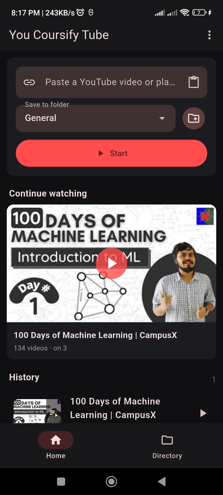
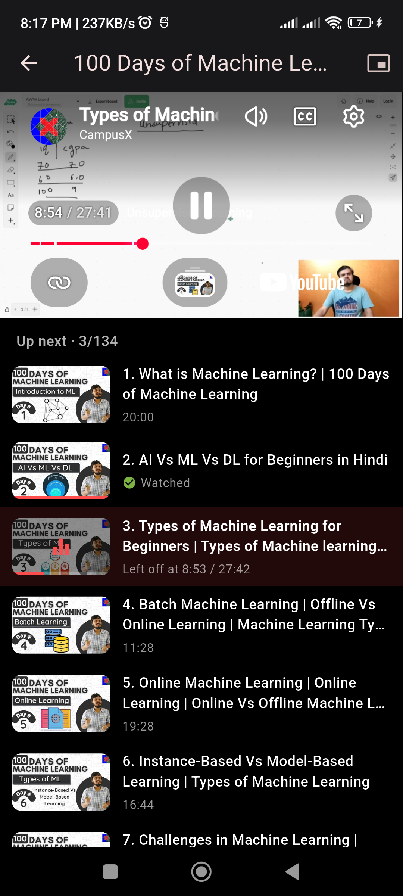
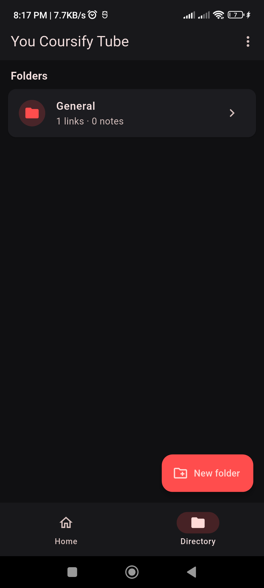
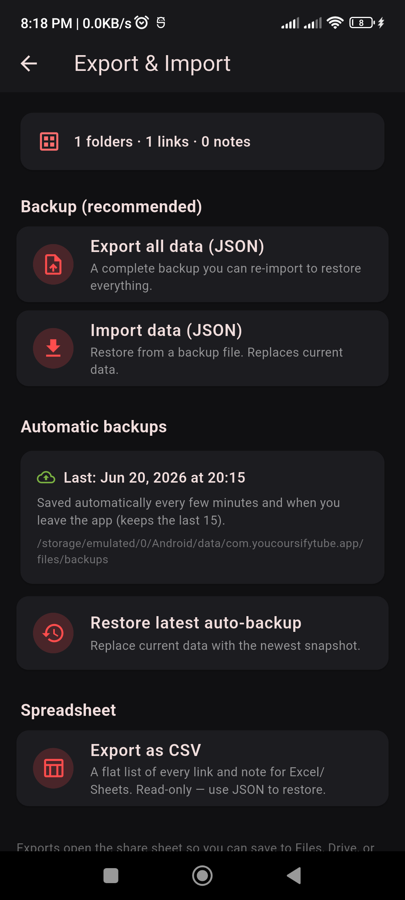

<p align="center">
  
</p>

<h1 align="center">You Coursify Tube</h1>

<p align="center">A distraction-free YouTube player for focused learning.</p>

---

Instead of an endless feed,
you save just the one video or playlist you want to study, organize links into folders,
take notes, and pick up exactly where you left off — every time.

No recommendations. No autoplay rabbit holes. Just the course you came for.

---

## Screenshots

**1. Home — paste a link, continue watching, and history**

<p align="center">
  
</p>

**2. Player — resume playback with custom controls and an "Up next" list**

<p align="center">
  
</p>

**3. Directory — organize your saved links into folders**

<p align="center">
  
</p>

**4. Export & Import — JSON/CSV backups and automatic snapshots**

<p align="center">
  
</p>

---

## Features

- **One link at a time** — paste any YouTube video or playlist URL and start
  immediately. The player stays inside the app; there's no feed to fall into.
- **Resume automatically** — every video remembers the exact second you stopped.
  Reopen the app and it drops you straight back into what you were watching.
- **Continue watching & History** — the Home tab surfaces the active item and a
  full history of everything you've opened, most recent first.
- **Folders (Directory)** — group links into named folders to keep separate
  courses or topics organized. Deleting a folder moves its links to *General*
  rather than destroying them.
- **Playlists** — saved playlists track which video you're on so a multi-part
  course resumes at the right episode.
- **Study notes** — write free-text notes per folder. Any YouTube link inside a
  note is tappable and opens in the in-app player.
- **Custom player controls** — center play/pause and a bottom-right fullscreen
  toggle, plus picture-in-picture support.
- **Export / Import** — back up everything to a single JSON file and restore it
  on any device, or export a flat **CSV** of all links and notes for
  Excel/Sheets.
- **Automatic backups** — the app quietly snapshots your data every few minutes
  and whenever you leave it, keeping the last 15 so you can roll back.
- **Dark, focused UI** — a Material 3 dark theme built for long study sessions.

---

## Tech stack

- **Flutter** (Dart SDK `^3.11.1`), Material 3
- [`youtube_player_iframe`](https://pub.dev/packages/youtube_player_iframe) — in-app playback
- [`youtube_explode_dart`](https://pub.dev/packages/youtube_explode_dart) — video/playlist metadata
- [`simple_pip_mode`](https://pub.dev/packages/simple_pip_mode) — picture-in-picture
- [`shared_preferences`](https://pub.dev/packages/shared_preferences) — local persistence
- [`share_plus`](https://pub.dev/packages/share_plus) · [`file_picker`](https://pub.dev/packages/file_picker) · [`path_provider`](https://pub.dev/packages/path_provider) — export / import / backups

All data is stored **locally on the device** — there is no account and no server.

---

## Getting started

**Prerequisites:** the [Flutter SDK](https://docs.flutter.dev/get-started/install)
(Dart `^3.11.1`).

```bash
# Install dependencies
flutter pub get

# Run on a connected device or emulator
flutter run

# Build a release APK
flutter build apk --release
```

---

## Project structure

```
lib/
├── main.dart                  # App entry, theme, periodic auto-backup
├── navigation.dart            # Opening saved items / raw URLs in a player
├── models/
│   ├── media.dart             # VideoItem, PlaylistData, VideoProgress
│   └── library.dart           # Folder, LibraryItem, Note, Library
├── state/
│   └── library_controller.dart   # In-memory state + persistence
├── services/
│   ├── storage.dart           # Load/save the library
│   ├── youtube_service.dart   # Parse links, fetch video/playlist data
│   ├── playlist_scraper.dart  # Resolve playlist contents
│   ├── backup_service.dart    # JSON / CSV export & import
│   └── auto_backup_service.dart  # Rolling automatic snapshots
├── screens/
│   ├── home_shell.dart        # Bottom-nav shell (Home / Directory)
│   ├── home_tab.dart          # Paste, continue watching, history
│   ├── directory_tab.dart     # Folder list
│   ├── folder_screen.dart     # Contents of a folder
│   ├── single_player_screen.dart # Single-video player
│   ├── playlist_screen.dart   # Playlist player
│   ├── note_editor_screen.dart   # Note editing
│   └── backup_screen.dart     # Export / import / restore
└── widgets/
    ├── add_link_form.dart     # Paste-a-link input
    ├── item_tile.dart         # List tile for a saved item
    └── pip_player_scaffold.dart  # Picture-in-picture scaffold
```

---

## How it works

On launch the app loads your saved library (folders, links, notes, and resume
positions) from local storage and, if you were mid-video, reopens it
automatically. Playback progress is stored centrally per video ID, so the same
video shows the same resume point everywhere it appears — as a saved link, a
playlist entry, or a link inside a note. Every change marks the library for the
next automatic backup.
